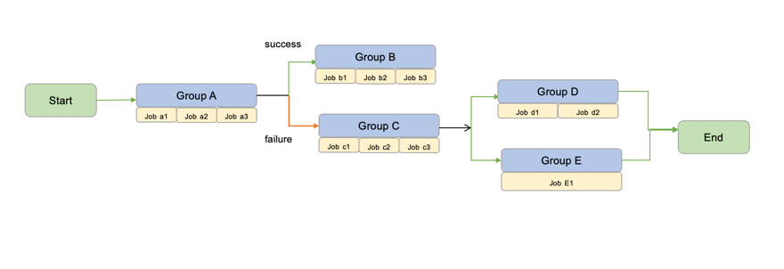

## **Complex Async API**

This module is an extention to the simple Async Api designed for triggering of long-running processes 

Desired Functionality
   -  One group can have multiple jobs or multiple groups 
   - A job represents a long-running process.A long-running process can be system sleep / logging and it may intermittently run
forever to simulate a system failure.
  - With workflow, we can manage the group to group dependency (a downstream group will be
triggered sequentially after the upstream group is finished). If the upstream group fails, we
can choose whether we continue with the downstream group or skip the execution of the
downstream group.

### **Group Lifecycle**

The following are the execution status of the group.

Positive Flow
1. Running
2. Successfull

Negative Flow
1. Skipped
2. Failed

**Assumption**

It is assumed that the group status is not dependent on the underlying jobs , since if it is required to wait for the child jobs to finish the complete process will become Synchronous in nature. 

### **Design Considerations**

1. Since the groups can be chained, it is important to ensure that the workflow is DAG in nature , i.e it does not contain any cycles of execution.
2. Every group execution will branch in two states `Success` and `Failed` , these states further define the next step of execution.
3. Its desirable to consider `Success` as the default branch if no branch rules are defined.

### **Design Changes**
1. The group to job execution definition remains same and can be reused.
2. The job_id now cannot be passed back to the client directly, but instead are required to be stored in a database for tracking purpose.
3. The workflow definition will be required to be moved to a script for more complex branching and execution.

DAG flow diagram

Process flow diagram